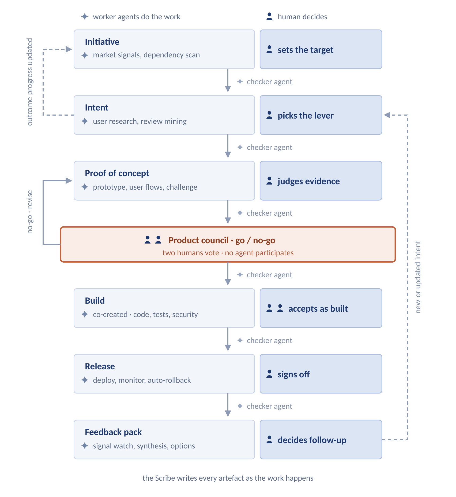
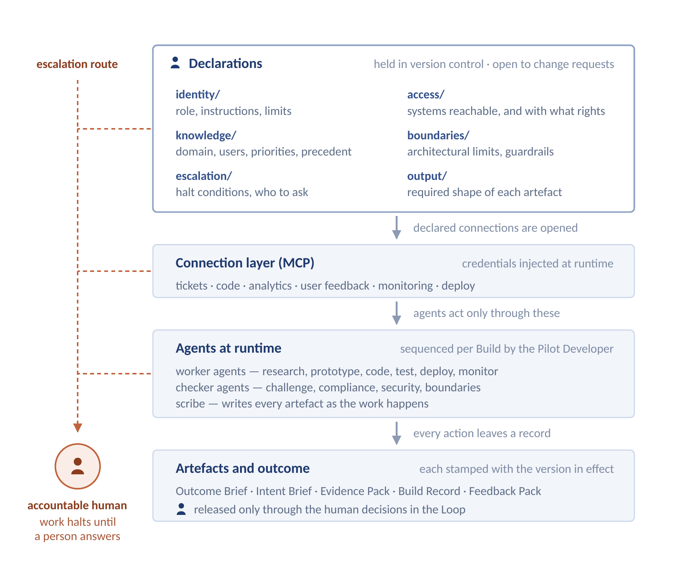

# THE ATOMIC STREAM

**A DELIVERY FRAMEWORK FOR AGENTIC SOFTWARE TEAMS**

*When construction is cheap, judgement becomes the constraint.*

**Version 2.4**

September 2026

Julia Waanders

Licensed CC BY 4.0 — share and adapt with attribution.

github.com/Atomic-Stream/framework

## Purpose of This Guide

The Atomic Stream is a delivery framework for teams in which AI agents perform the majority of production work. This guide defines the framework: its theory, its values, the accountabilities of the people within it, the artefacts they produce, and the events that hold it together.

The framework is deliberately incomplete. It defines the minimum set of rules required for agentic delivery to remain coherent at scale. It does not prescribe engineering practices, tooling, or organisational design beyond that minimum. Teams add what their context requires. Teams that remove elements described here as required are not practising the Atomic Stream.

Throughout this guide, "must" indicates a rule of the framework. "May" indicates a permitted variation. Where a rule exists, its rationale is given, because a rule whose purpose is not understood will be discarded under pressure.

The framework has a companion repository holding the declarations this guide requires, published as they are written. It is described under Agent Foundations, and is at github.com/Atomic-Stream/framework

### Where This Framework Came From

This guide is an argument from practice rather than a survey of the field.

Its origin is specific. Working as a Product Owner alongside a single developer in a small company, with agents taking an increasing share of the construction, I found the two of us producing at a rate I had not seen in organisations a hundred times the size. The question that produced this framework was not whether that was pleasant to work in. It was what it implies for organisations that cannot operate as two people — and whether the thing making us fast would survive being scaled.

I had spent the preceding decade building the structures that answer that question at full size: a 200-person value stream, a 250-person portfolio, PI Planning, and the layers of proxy ownership that scaled agile produces. The reasoning here therefore runs in one direction throughout — from what demonstrably works at two people toward what would have to hold at two hundred — and the rules exist at the points where that translation breaks.

What follows is a position arrived at, not a consensus reported. It has been written and revised since February 2026, and tested against practitioners, a CTO review, and its own application in a regulated product. It has not been tested against the literature. Field studies of agentic engineering at scale are now being published, and comparing this framework against that evidence — where it is corroborated, where it is contradicted, and where it is simply silent — is the next piece of work rather than part of this one.

## Definition

*The Atomic Stream is a lightweight framework in which small pairs of accountable humans direct teams of AI agents to deliver validated software outcomes, governed by artefacts held in version control.*

The framework rests on a single structural proposition: where agents can generate, test and document code faster than people can review it, the binding constraint on delivery shifts from construction toward validation. What then most needs coordinating is the decision about what to build, and the evidence that customers need it.

The Atomic Stream is accordingly organised around validation gates rather than iteration cycles. Its unit of progress is a validated outcome. Its unit of delivery is a pair.

### Where the Framework Applies

The Atomic Stream is designed for building new products under uncertainty. It is not designed for automating routine processes, and organisations should not adopt it for that purpose.

The distinction matters because it determines what the human contributes. Automating a known process has a known objective, a known method, and an output that can be verified against a specification. The only failure mode is error, and a human checkpoint is sufficient to catch it. Building something new has none of these. There is no specification to verify against, because producing the specification is the work. The failure mode is not error but irrelevance — building something correct that no customer needed.

A framework for the first case can safely reduce the human to an approver. A framework for the second cannot, because the judgement about what is worth building and whether the result is any good is the entire contribution, and it is the one thing agents cannot supply.

What the Atomic Stream optimises for follows from that: keeping judgement with people while agents carry the production, and leaving a record complete enough to be audited — at a cost structure that lets a small number of people deliver against real commercial pressure.

The artefacts this framework defines are produced as the work happens, by the agents doing it, rather than written afterwards by the people who did it. Where documentation competes with delivery for the same human hours it tends to lose, and the record drifts out of date. Here the human writes the specification, which is thinking, and reviews the output, which is judgement; the record itself is written by agents at the moment of the work.

## Atomic Stream Theory

*Seven principles, and the reasoning the rules rest on.*

### Why This Framework Is Explicit

Frameworks for human teams can leave a great deal unstated, because human teams run on an enormous substrate of tacit knowledge. The correction that happens in a corridor and never in a ticket. The colleague everyone knows to ask. The shared and unwritten sense of how things are done here. That substrate carries much of the coordination load, invisibly, and every framework designed for people has quietly depended on it.

Agents have none of it. An agent knows what is written and nothing else: it does not absorb context by proximity, learn from a conversation it was not part of, or develop judgement about how this organisation prefers to work. Agentic delivery therefore has to make explicit what could previously be left unsaid. This is not a preference for process. It is a property of the medium.

The specificity that follows is directed at agents, not at people. The Atomic Stream constrains the form in which a decision reaches an agent. It does not prescribe how a Product Owner investigates a problem, how a Pilot Developer solves one, or what either chooses to attempt. Within their boundaries the people in this framework are meant to decide freely, because the coordination that would otherwise consume their attention is carried by artefacts, and those artefacts are written by agents rather than by them.

*The framework is strict with agents so that it can be loose with people.*

**1. Validation precedes construction**

No production code is written against an unvalidated hypothesis. When building is cheap, the dominant cost of a wrong decision is not the build — it is the maintenance, the migration, the support load, and the opportunity cost of the correct thing not built. Validation is therefore not a phase that competes with delivery. It is the gate that delivery passes through.

**2. Maximise the work not done**

The capacity to produce is not a reason to produce. Friction used to suppress features nobody needed and documents nobody read; with that friction largely gone, restraint has to be deliberate. Work is not built until it is validated, complexity that has stopped earning its keep is removed rather than maintained, a Stream should expect to discard much of what it validates, and a Pair holds few Intents at once.

Where output is abundant it is unlikely to be a differentiator: what one organisation can produce in volume, its competitors can too. What stays scarce is judgement — about what to build, whether the evidence supports it, and whether the result is any good. The framework spends its capacity there.

**3. Every handoff is an artefact**

Information moves between people and between agents only through named, versioned artefacts. Verbal briefings, chat threads, and undocumented context do not constitute handoffs. This rule exists because agents cannot be briefed informally and because work performed by agents is otherwise opaque: the artefact is the only record that a human can inspect, a regulator can audit, and a successor can inherit.

**4. Autonomy inside boundaries, escalation at edges**

A pair decides freely within its domain and escalates at its edges. Boundaries are defined in advance, in writing, by the System Architect. This rule replaces coordination meetings with pre-agreed limits. Where limits are explicit, most decisions require no consultation; where they are not, every decision does.

**5. Governance is executable**

The rules a team operates under are held in the same repository as the code, in a form agents read at execution time. Governance that lives in a document read once at onboarding degrades continuously and invisibly. Governance that agents load on every run is enforced by construction, versioned by default, and changed through review.

**6. Humans stay in command**

Every artefact has exactly one accountable human. Agents produce and agents check, but an agent is never accountable for an outcome and no decision is closed by an agent. This is not a concession to regulation; it is what prevents the diffusion of responsibility that occurs when a system can plausibly be blamed.

The command is directive rather than supervisory. Three of the human decisions occur before any agent has produced anything: the outcome target, the lever chosen to move it, and the judgement of whether gathered evidence justifies building. A person here is not positioned at the end of an agent process to approve or veto its output; they originate the intent the process exists to serve.

**7. Human capacity is finite and is the real constraint**

The framework concentrates into two people work that was previously spread across a team, and stakes its results on the quality of their judgement. That judgement is the one input agents cannot supply, and it is not inexhaustible: it degrades with sustained intensity, and it leaves the organisation entirely when the person does.

Capacity is therefore treated as a design constraint rather than a matter of goodwill. Time to recover and time to develop capability are scheduled work, not personal initiative exercised after hours. An organisation that treats the people in these roles as interchangeable, or as capable of indefinite intensity, will lose them — and with them the most valuable thing the Stream holds.

## Atomic Stream Values

The principles describe how the framework is built. The values describe what the people practising it have to bring. The distinction matters: a principle can be enforced by a rule, whereas a value can only be held. Where these five are absent the rules still execute, but they produce ceremony rather than anything of value.

**Evidence.**  Claims about customers are supported by observing them. Confidence is not evidence, seniority is not evidence, and an agent's fluency is not evidence. Where evidence is thin, the framework asks that this be said rather than obscured.

**Transparency.**  Work is visible as it happens rather than summarised afterwards, including work that is going badly. A system running at agentic speed cannot correct what it cannot see.

**Courage.**  The framework asks people to say no to their own ideas. A Proof of Concept the Product Owner believed in is brought to the Council with the evidence as it actually fell, a No-Go is accepted without relitigation, and an agent that has stopped is not overridden because the deadline is close.

**Ownership.**  Accountability is assigned by the framework; ownership is what makes it real. Reviewing an agent's output is not a formality but the act by which a person takes responsibility for it, and an artefact approved without being read is unowned whatever the record says.

**Care.**  The people in these roles carry concentrated responsibility, and they have finite attention and real need for recovery. Partners protect each other's capacity as a condition of the work rather than a courtesy extended when convenient.

## The Atomic Stream

*The container: what a Stream is, and what it holds.*

An Atomic Stream consists of five to eight Atomic Pairs, one Stream Orchestrator, and one System Architect. It owns a bounded product domain, a roadmap, and a set of outcomes it is accountable for.

A Stream has an upper bound, and around eight Pairs is where the framework expects to find it: beyond that, cross-Pair dependency density tends to grow faster than one Architect's capacity to govern it and coherence degrades. A Stream that outgrows its bound splits into two, each with an independent roadmap, an independent Architect, and a clear domain partition. The framework scales by replication rather than centralisation.

### The Atomic Pair

The Atomic Pair is the unit of delivery. It consists of one Product Owner and one Pilot Developer, each directing a team of agents.

The Pair is jointly accountable for outcomes within its domain. It decides what to validate, how to build what has been validated, and when to escalate. It does not decide its own boundaries, its own outcomes, or its own release tier.

The Pair is not a relay. Its two members do not work in sequence, handing an artefact from one to the other; they work the same problem with different accountabilities. This is most visible during the Build, which is co-created rather than delegated. Being present does not mean the Product Owner watches every hour of implementation — it means product decisions are taken while the work is forming rather than after it is finished, so that ambiguity is resolved by the person accountable for it at the moment it arises.

A consequence follows that organisations should accept deliberately rather than discover later: a Pair holds very few Intents at any one time, often one. Both members are engaged in the same work, so the Pair cannot parallelise the way a squad divided into specialists could. Throughput comes from the speed of the loop, not from the number of loops running at once.

Every accountability in a Pair must be recoverable by someone else within a working day. Two people holding a Stream's work between them is otherwise a single point of failure: illness, leave or a resignation halts the Pair, and the context needed to continue may exist only in one person's head. This follows from principle 3 — the State of the Union is an artefact, continuously written, and it is what makes handover possible at all.

A Pair operating under the Hydra Model consists of four people: two Product Owners sharing one accountability and two Pilot Developers sharing one accountability, each working a reduced week at full compensation. It is the recommended mechanism for recoverability, though a permitted variation rather than a requirement; a documented State of the Union with a named successor is the minimum. Where job-sharing is adopted, partners must overlap for a defined weekly period.

The framework is demanding of the individuals within it. Two people carry accountability that was previously distributed across a squad, at higher tempo and with fewer people to absorb error. This is the reason the framework requires experienced practitioners in both roles and treats recovery as structural rather than discretionary.

## Accountabilities

*Four Stream accountabilities and one shared function. Each accountability is held by a person, not shared, not rotated within a cycle.*

Roles in the Atomic Stream are defined by what they are accountable for, not by which agents they operate or which tools they use. Agent teams change as capability changes; accountability does not.

### The Product Owner

The Product Owner is accountable for whether the right thing was built: something that meets a need customers actually have.

- Owns the Intent from assignment to outcome, and may not alter it — only the Stream Orchestrator revises an Intent.
- Owns the Proof of Concept: the hypothesis, the evidence gathered, and the decision to bring it to the Product Council.
- Owns the Feedback Pack and is the only person who may close one.
- Accepts the Build. Acceptance is a condition within the Definition of Done, exercised continuously during the co-creation session rather than granted at a gate afterwards.

Directing agents does not delegate the accountability: a Proof of Concept submitted with weak evidence is the Product Owner's failure, not the agent's. The Product Owner does not decide how code is written, what architectural boundaries exist, or when a release is exposed.

### The Pilot Developer

The Pilot Developer is accountable for whether it was built correctly.

- Owns the Build from Product Council approval to deployment behind a flag, and works it as a co-creation session with the Product Owner present.
- Authors and sequences Agent Briefs, and reviews every artefact agents produce against them.
- Owns technical acceptance: code quality, test sufficiency, and adherence to architectural boundaries.

Generated code must be reviewed before it is committed. Review is the act by which accountability is assumed; a framework in which unreviewed generated code reaches production has no accountable human for that code. The Pilot Developer does not decide what is built, does not set boundaries, and does not determine release timing.

### The Stream Orchestrator

The Stream Orchestrator is accountable for the Stream delivering the outcomes it exists to deliver.

- Owns the roadmap and the outcome targets that all Intents must serve — commonly expressed as OKRs, though the framework does not require that method.
- Assigns and revises Intents, and is the only person who may do so.
- Holds the product-domain vote on the Product Council.
- Is accountable for coherence across Pairs: that two Pairs are not solving the same problem, and that no Pair is solving a problem the Stream does not have.

The Orchestrator does not decide how an Intent is fulfilled; selecting the approach, the evidence and the proposed solution is the Product Owner's work.

### The System Architect

The System Architect is accountable for the system remaining coherent as it changes.

- Defines domain boundaries: which code belongs to which Stream, and what contracts exist between them.
- Owns non-functional requirements and technical debt strategy.
- Owns the configuration artefacts: agent templates, tool permissions, guardrails, and architectural principles.
- Holds the technical-domain vote and veto on the Product Council.

The System Architect is a peer of the Stream Orchestrator. Neither may overrule the other within the other's domain. A validated Proof of Concept may be blocked on architectural grounds; a technically sound proposal may be blocked on product grounds. Where the two conflict, the proposal is revised — it is not escalated to a third party for arbitration, because no such authority exists in the framework.

The Architect sets rules and does not review every change. Enforcement is delegated to agents; the Architect is the escalation point when enforcement fails or when the rule itself is wrong.

### Platform Engineering

Platform Engineering is accountable for the ground the Streams run on. It is a shared function rather than a Stream accountability: it serves every Stream and belongs to none.

- Operates the release pipeline, the monitoring layer, and the agent infrastructure.
- Maintains the declarations that define what agents are, what they may reach, and what shape their output must take.
- Governs how a change to those declarations reaches the Streams.

That last point is where the function is most easily underestimated. A change to a declaration is a change to how every agent in every Stream behaves, and pushing it carelessly is closer to a production deployment than to a document edit. Three classes govern how a merged change propagates.

| **Class** | **Applies to** | **Propagation** |
|---|---|---|
| **Mandatory** | Compliance, security, regulatory obligation. | Applied immediately. No Stream may decline. |
| **Reviewed** | Presentation standards, outcome context. | Raised as a change request. Merges automatically after a defined review window. |
| **Proposed** | New capabilities, workflow changes, strategic shifts. | Requires acceptance. Declines are recorded with reason. |

Mandatory changes exist so that a compliance or security correction cannot be declined by a Stream under delivery pressure. Proposed changes exist so that the platform cannot quietly redefine how a Stream works without its lead agreeing.

## Agents

*What agents are, what they are not, and who owns them.*

### Templates and Agents

**A template**  is a versioned configuration file in the platform repository. It defines what an agent is: its instructions, the tools and connectors it may use, its guardrails, and its limits. A template performs no work. Templates change infrequently and only through review.

**An agent**  is a running instance of a template, executing one brief in one context. It produces an artefact and ends. Its memory is the artefact it committed, not the session in which it worked.

One template produces many agents. One brief produces one artefact. An agent that has not committed an artefact has produced nothing the framework recognises.

### Worker Agents and Check Agents

Every agent in the framework is one of two kinds.

**Worker agents**  produce. They research users, generate prototypes, write code, write tests, and write documentation. Worker agents create the artefacts that move through the Loop.

**Check agents**  validate. Between every step, one or more check agents verify that what was produced meets the standard required before the next step may begin: that a hypothesis has been challenged, that a boundary has not been crossed, that tests cover the criteria, that a compliance tier has been assigned.

Every step in the Loop must have both. A step with workers and no checks produces unvalidated output at speed, which is the failure mode the framework exists to prevent. A check agent's finding does not block work by itself — it raises the finding to the accountable human, who decides.

### The Scribe

The framework requires a documentation service — the Scribe — which writes artefacts as work happens. It is not a member of any agent team. It is a shared capability that any agent in any team invokes to record an artefact, update a ticket, or append to the State of the Union.

The Scribe must be shared rather than duplicated per Pair. A Stream in which each Pair maintains its own record produces several partial views in inconsistent formats, none of which can be audited as a whole and none of which a successor can inherit cleanly. One service means one format, one record, and one complete trail.

The Scribe is what makes the artefacts of this framework affordable. Because it writes as work occurs, the record is current by construction rather than by discipline. It is also what makes accountability transferable: the State of the Union it maintains is what allows one person to hand a live accountability to another within a working day, which is the condition on which the Hydra Model depends.

The Scribe records. It does not decide, does not approve, and does not close anything.

### Ownership

Agents belong to the Stream, not to the person operating them. Access is granted by role. When a person leaves, their successor inherits the agents and their accumulated context. No agent configuration of value exists only in an individual's private environment.

This rule exists because the alternative reproduces, in a new medium, the failure that personal spreadsheets and private wikis produced in the old one: institutional knowledge held where the institution cannot reach it.

## The Loop

*Six steps from strategy to evidence, and back.*

Work in the Atomic Stream moves through six steps. Each has one accountable human, produces one primary artefact, and ends at a gate. A step may not be skipped, and work may return to an earlier step at any time.

It is called a loop rather than a pipeline because it does not terminate. What is released generates signal, the signal is decided upon, and the decision opens or amends the next Intent. A Stream should expect to move from a new Intent to a Go or No-Go decision in weeks rather than quarters; the interval from that decision to a release depends on what was approved.

*The Loop. Worker agents produce, a checker agent validates each handoff, and a human decides at every step. Solid connectors carry work forward; dashed connectors return information — a closed Intent updates the Initiative, a Feedback Pack opens or amends one. What allows agents to work unattended between these decisions is set out under Agent Foundations.*

### Step 1 — Initiative

An Initiative states an outcome the organisation intends to achieve and the measure by which achievement will be judged. It is set by the Stream Orchestrator and is not negotiated by Pairs.

An Initiative describes a result, not a solution. "Increase repeat purchase rate among first-time buyers by 15% by Q4" is an Initiative. "Ship a loyalty programme" is not.

### Step 2 — Intent

An Intent identifies a specific lever believed to move an Initiative, and states what would have to be observed for the belief to be confirmed. It is assigned by the Stream Orchestrator to one Product Owner and remains open until the outcome is met or the Orchestrator closes it.

An Intent is a customer problem, not a feature. It defines why the problem matters to the customer and what success looks like. How the Intent is fulfilled is the Product Owner's decision.

*Steps 1 to 3 determine whether the Stream produces value; the remaining steps determine whether it produces it correctly. Where construction is inexpensive, the quality of the lever chosen and the rigour with which it is tested matter more to results than the speed of the build.*

### Step 3 — Proof of Concept

The Product Owner builds a working prototype with agent support, exposes it to real customers from the target group, and gathers evidence. The Proof of Concept is then brought to the Product Council for a Go or No-Go decision.

No production code may be written before a Go decision. This is the central rule of the framework.

A Proof of Concept must contain a working prototype, evidence from exposure to real customers, a stated hypothesis with the threshold that would confirm or reject it, acceptance criteria, and an assigned release tier.

The Proof of Concept is not an exploratory exercise run alongside delivery. It is the gate delivery passes through, and there is no committed work for it to compete with because nothing has been authorised yet. What makes it practical is cost: a working prototype that would once have taken a team weeks now takes a Product Owner days, so the question of whether to build can be answered with evidence rather than argument.

### Step 4 — Build

The Build is a co-creation session between the Product Owner, the Pilot Developer, and their agents. The Pilot Developer decomposes the approved Proof of Concept into Agent Briefs, sequences them, and reviews each artefact produced. The Product Owner is present as the work forms, resolving ambiguity, judging trade-offs, and accepting or rejecting what emerges as it emerges.

There is no acceptance meeting and no handover between the two. A formal acceptance gate after the Build would queue finished work behind a review, and finished work is the most expensive point at which to discover that something is wrong. Acceptance is instead a condition within the Definition of Done: the Build cannot be done until the Product Owner has accepted it, and that acceptance is recorded against the artefact rather than obtained at an event.

Acceptance criteria are inherited from the Proof of Concept and are not rewritten during the Build. Implementation sometimes shows them to be unachievable as written, ambiguous once made concrete, or mistaken about what customers need — and when that happens the criteria are not quietly adjusted to match what was built. The work returns to Step 3, where the Product Owner revises the hypothesis and, if the change is material, brings it back to the Product Council. This rule exists because criteria edited mid-build to fit the code can no longer be evidence of anything: the test becomes a description of the result rather than a standard it had to meet.

The Build ends when the Definition of Done is met and the code is deployed behind a flag. Deployment is not release.

### Step 5 — Release

Release is the exposure of deployed code to users. It is a separate decision from deployment, governed by the release tier assigned during the Proof of Concept.

| **Tier** | **Definition** | **Release rule** |
|---|---|---|
| **Tier 1** | Reversible. No regulatory exposure. Failure is recoverable by flag. | Automatic. Monitored. Rolled back automatically on threshold breach. |
| **Tier 2** | Functionally significant. Recoverable but user-visible. | Staged rollout under Platform Engineering supervision. |
| **Tier 3** | Irreversible or regulated. Data migrations, financial operations, regulated processes. | Blocked until named compliance sign-off is recorded against the ticket. |

The release decision is taken when the tier is assigned, not when the flag is flipped. Tier 1 automation executes a judgement a person has already made and recorded; it does not substitute for one. Automatic rollback is the same: the threshold is a human decision, expressed in advance so that it can act at machine speed.

### Step 6 — Feedback

After release, monitoring agents observe how customers use the product, errors, support contacts, customer conversations, and public reviews. When a threshold is crossed, a Feedback Pack is created and enters the Product Owner's queue.

A Feedback Pack must be closed with one of three documented decisions: open a new Intent, update an open Intent, or close without action with a stated reason. It may not be closed without a decision, and it may not be closed by an agent.

This rule exists to close the loop that most delivery systems leave open: between what was released and whether it met the customer's need. Signal that is observed but not decided upon is indistinguishable from signal that was never gathered.

## Artefacts

*What the framework produces, and what each artefact commits to.*

Artefacts in the Atomic Stream make work visible. Each carries a commitment: a statement against which the artefact can be judged. An artefact without its commitment is a document; an artefact with it is a control.

Every artefact here is produced by the work itself. None of it is written up afterwards; the Scribe records each one as the step it belongs to completes.

### Flow Artefacts and Their Commitments

| **Step** | **Artefact** | **Contains** | **Commitment** |
|---|---|---|---|
| 1 Initiative | **Outcome Brief** | The outcome, its measure, and the date it is judged by. | Outcome Target — the measurable result the Stream is accountable for. |
| 2 Intent | **Intent Brief** | The customer problem, the customers affected, the hypothesis, and the success condition. Authored by the Product Owner. | Success Condition — what must be observed for this lever to be considered effective. |
| 3 Proof of Concept | **Evidence Pack** | The prototype, the evidence from exposure to real customers, the logic map, acceptance criteria, and the assigned release tier. | Validation Threshold — the evidence required to justify building, stated before it is gathered. |
| 4 Build | **Build Record** | The Agent Briefs, the reviewed output, the acceptance proof, and the code deployed behind a flag. | Definition of Done — the quality standard a change must meet to be deployable, including acceptance by the Product Owner. Held by the Stream, not per Pair. |
| 5 Release | **Release Record** | The flag state, the rollout, and any tier sign-off. | Release Tier — the reversibility and regulatory exposure of the change, which determines who may release it. |
| 6 Feedback | **Feedback Pack** | The synthesised customer signal, its sources, and the recorded decision. | The Decision — what the Stream will do about the signal, recorded and attributable. |

The Definition of Done is held at Stream level and applies to every Pair. A Pair may apply a stricter standard; no Pair may apply a weaker one. Where the Definition of Done changes, it changes for the Stream.

The logic map inside an Evidence Pack is the intended behaviour expressed in prose before code exists, decomposed into the units of work agents will execute; the Pilot Developer authors it. The acceptance proof inside a Build Record is those criteria in a form agents can test against.

## Agent Foundations

*The groundwork the framework rests on: what is declared, how it is governed, and when an agent must stop.*

The Loop describes agents doing the work of every step while humans decide between them. Foundations is what has to be in place for that arrangement to hold.

Foundations is the agent's harness: everything around the model that makes it an agent. Without one, an agent works neither effectively nor safely. The harness is the framework's infrastructure and its governance at once. It is not produced by the work; it is the ground the work stands on — a set of declarations, held in version control, that determine what agents may do at all. Where the artefacts of the Loop accumulate as delivery proceeds, these are settled beforehand and change rarely. An artefact records what happened; a declaration determines what is permitted to happen.

Nothing here is optional. A Stream that has not settled these questions is not running a governed system; it is running agents and hoping.

### What Must Be Declared Before an Agent Runs

An agent works without supervision between one human decision and the next. That is only tolerable when six things have been settled in advance and written where the agent reads them at execution time.

| **The question** | **Declared in** | **What it settles** | **Maintained by** |
|---|---|---|---|
| **What it is** | identity/ | The agent's role, its instructions, and the limits on how it behaves. | Platform Engineering |
| **What it may reach, and with what rights** | access/ | Which systems and data it may connect to, and whether it may read, write, or administer each. Reach and rights are separate questions: an agent that can read a repository and one that can write to it are not the same agent. | Platform Engineering |
| **What it knows** | knowledge/ | The product domain and its customers, the current outcome targets, the presentation standards it observes, and the record of how comparable questions were settled before. | Stream Orchestrator |
| **What it must not do** | boundaries/ | The architectural limits it may not cross, and the behavioural guardrails carried in its own definition. | System Architect |
| **When it must stop and ask** | escalation/ | The conditions that require a halt rather than a judgement call, and the person to raise them to. | System Architect |
| **What its output must look like** | output/ | The required shape of the artefact it produces, in a form specific enough to be checked. | Platform Engineering |

The six folders are how the companion repository is arranged, one per question, in the order asked. Their contents will change as tooling does; the questions will not.

*The foundation layers. The Loop states that agents do the work; this is what allows it. Humans author the declarations at the top and decide at the bottom — and at any layer, an agent that cannot proceed halts and raises to the accountable human rather than deciding for itself.*

### Escalation

Of the six, escalation is the one most often omitted and the one that most directly determines whether unsupervised work is safe. An agent that cannot proceed correctly will proceed anyway unless instructed otherwise, and what it produces will be fluent and wrong — which is harder to detect than an obvious failure.

The escalation policy specifies the conditions that require an agent to stop. At minimum: the brief is ambiguous or internally contradictory; required information is missing; a result contradicts the acceptance criteria the agent was given; the work would require an action outside the agent's declared permissions; or the change touches a Tier 3 concern.

It also specifies what stopping means. The agent halts, records what it was attempting and why it stopped, and raises to the human accountable for that artefact. It does not select an interpretation, silently narrow the scope, substitute an adjacent task it is able to complete, or mark the work done.

*An agent that cannot proceed must stop visibly rather than proceed plausibly.*

The order in which agents run is not declared. Sequencing is authored per Build by the Pilot Developer in the Agent Briefs, because dependencies differ for every change.

### Why Governance Lives in a Repository

The declarations are held in the same repository as the code, under the same version control, and are loaded by agents at execution time. That single decision produces three properties the framework depends on.

**It is applied rather than published**

A rule in a document is enforced by whoever remembers it. A rule that agents load on every run is enforced by construction — it cannot be forgotten, skipped when someone is busy, or quietly interpreted away. The distance between the stated policy and the operating policy, which in most organisations is wide and unmeasured, closes to nothing.

**It stays alive**

Governance documents decay because nothing depends on them. A policy page written at adoption is read once, referred to rarely, and is wrong within a year without anyone noticing — the organisation has moved and the document has not. Configuration cannot decay in that way, because it is load-bearing: it is read hundreds of times a day by the agents doing the work, and a rule that no longer matches reality produces visibly wrong output rather than silent drift. Staleness surfaces as a failure instead of accumulating as a fiction.

**It is open to challenge**

Because the rules live where code lives, the mechanism for changing them is the one every practitioner already uses. Anyone in the Stream may raise a change request against any rule they operate under. It is discussed against a specific diff rather than in the abstract, the accountable owner accepts or declines it, and the decision is recorded with its reasoning attached.

The people closest to the work — the ones who discover that a boundary is wrong or a guardrail miscalibrated — can act on that knowledge directly, in the same week, through a route open to all of them. The decision remains the owner's. What changes is that proposing is no longer a question of access.

*Governance becomes something practitioners can amend rather than something done to them.*

Where the platform supports it, the declarations may be distributed as an installable package so that every Pair receives the same set from a single governed source. How a merged change reaches the Streams is set out under Platform Engineering.

The framework requires version control, review, and an open route to propose change. It does not require a particular product — and credentials are the one thing excluded from the repository, held in the organisation's secret store and injected at runtime.

## Oversight and Auditability

*What the framework guarantees about human control over agent work.*

When most of the production work is performed by agents, three questions become harder to answer and more important to answer well: who decided, on what basis, and can it be shown afterwards.

The Atomic Stream addresses these through the structure already described rather than through a separate compliance process laid over the top. The guarantees below follow from the rules in this guide; a Stream practising the framework should produce them without additional effort, and a Stream that cannot produce them is likely not practising it.

### The Guarantees

- Every artefact has exactly one accountable human, named. Accountability is not shared across a team and not attributed to a system.
- No decision is closed by an agent. Agents produce, agents check, and agents raise findings. Approving, rejecting, and closing are human acts in every case. Where release or rollback is automatic, it executes a judgement a person recorded in advance rather than making one.
- Every agent action traces to a brief authored by an identified person and to the review by which that person accepted the result. Generated work that no human reviewed does not reach production.
- Every change of consequence is recorded at the time it is made: what changed, who decided, on what evidence, and when. Boundary decisions are recorded in the decision record, product decisions in the artefact chain from Initiative to Feedback Pack.
- Every rule the agents operate under is versioned, and every change to those rules is reviewable as a diff with an author and a date.
- Every artefact records the version of the configuration in effect when it was produced. Rules change; artefacts are permanent. Without a recorded version reference, an artefact cannot be judged against the rules that actually applied to it, and the trail breaks at the point an auditor would press hardest.
- Irreversible and regulated changes cannot be released without a recorded sign-off by a named person. This is enforced by the release tier, not by convention.
- An agent that cannot proceed correctly halts and raises to the accountable human rather than deciding for itself. The escalation route exists at every layer, and work stays stopped until a person answers.

### In Command, Not In the Loop

A distinction is worth drawing precisely, because the two arrangements are often given the same name and they are not the same thing.

A human in the loop sits at the end of an agent process. The system produces, the person approves or vetoes, and the work proceeds. The person is a checkpoint on a process that would otherwise run without them, and their contribution is to catch what the system got wrong.

A human in command sets the objective the process exists to serve. The system executes against intent that originated with a person, within constraints a person defined, toward an outcome a person is accountable for. The Atomic Stream is this second arrangement, and the structure of the Loop demonstrates it: three of the seven human decisions occur before any agent has produced anything at all.

The seven decisions divide into three kinds.

- Direction, upstream of all agent work: the outcome target on the Initiative, the lever chosen on the Intent, and the judgement of whether gathered evidence is sufficient.
- Authority, at the gate: the Product Council decides whether a validated hypothesis justifies construction. Two humans vote and no agent participates.
- Oversight, downstream: the Product Owner accepts the Build, the release is exposed under the tier assigned before construction began, and the Product Owner closes each Feedback Pack with a decision.

Oversight is concentrated rather than continuous. A human does not supervise each agent action; that would reintroduce the bottleneck the framework removes, and in practice degrades into approval without attention. It occurs instead at defined points where a person examines evidence and takes a decision the framework records.

At each of those points, a person may decline. A framework in which the human step cannot produce a negative outcome does not have human oversight; it has human presence.

This record is a byproduct of working in the framework rather than something prepared for inspection. Records assembled after the fact describe what an organisation was able to reconstruct; records written as the work occurs describe what happened.

Organisations remain responsible for mapping these guarantees onto the obligations that apply to them. The framework defines the mechanism; which regime it must satisfy, and what evidence that regime requires, is properly determined by the organisation and its advisors.

## Events

*Five events. Each has a purpose that only humans can serve.*

The framework removes meetings that existed to move information, because artefacts move information more reliably. What remains are events that require human judgement, human negotiation, or human relationship. Every event has a fixed purpose and a maximum duration. An event that regularly ends early has served its purpose.

### The Product Council

Purpose: to decide Go or No-Go on a Proof of Concept. This is the only mandatory approval gate in the framework.

Chaired by the Stream Orchestrator. The Orchestrator and the System Architect are the two voting members; compliance, legal, finance and domain experts attend as advisors, raising risk and providing context without a vote. The Product Owner presents.

Timebox: one hour per proposal for Tier 2 and Tier 3, which meet synchronously. Tier 1 proposals are decided asynchronously within one working day.

The Council decides on the customer evidence presented. Because there are two voters and neither may override the other, a disagreement resolves as No-Go and the proposal returns for revision — the gate fails safe rather than deadlocking. A No-Go is not a failure of the Product Owner; it is the framework working. A Stream in which no Proof of Concept is ever rejected is either not gathering evidence or not acting on it.

### The Weekly Intent Review

Purpose: to surface cross-Pair dependencies and drift before they become collisions.

Attendance: all Product Owners and the Stream Orchestrator. Timebox: fifteen minutes. Where a Pair holds one Intent at a time, this is a short round of what each is working and where two might collide — not a review of progress.

This is not a status meeting. Status is visible in the repository. The event exists to catch the two failures artefacts do not reveal: two Pairs converging on the same problem, and a Pair drifting from the Intent it holds.

### The Weekly Demonstration

Purpose: to show what was released and what was learned.

Convened by the Stream Orchestrator. Timebox: thirty minutes. Open to the whole Stream and to anyone in the organisation; attendance is not mandatory and a recording is published.

The demonstration is not an approval gate. Approval occurred at the Product Council. This event exists to sustain cross-Pair awareness and to make delivery legible to people outside the Stream. Customers may be invited where the Intent allows.

### The Guilds

Purpose: to transfer practice between Pairs, and to raise systemic problems to the people who can fix them.

Timebox: one hour, monthly. Facilitated by a rotating member of each Guild — the role is deliberately not permanent. Each produces notes committed to the platform repository.

The Product Owner Guild examines validation practice: what evidence proved decisive, which techniques improved research quality, what patterns are appearing across Feedback Pack decisions. The Developer Guild examines build practice: which Agent Brief structures produced reliable output, which boundary escalations revealed a genuine gap, and which tools or declarations are failing in use.

The Developer Guild is the required channel by which problems with agent configuration reach the System Architect. Without it, the people who meet those failures daily have no route to the person who can correct them, and the declarations drift from operational reality while appearing current.

### The Monthly Recalibration

Purpose: to improve the way the Stream works, as distinct from what it has built.

Convened by the Stream Orchestrator, who prepares the inputs. Duration: one to one and a half days depending on the size of the Stream. Attendance: all Pairs, the Orchestrator, and the System Architect. No new work is started during it.

Inputs are the month's Feedback Packs, the record of boundary escalations, evidence of agent and tooling performance, progress against outcome targets, and both Guilds' notes.

Outputs are changes to configuration artefacts — templates, boundaries, tooling, principles — and an entry in the process record noting what changed and why.

*The Feedback Pack asks whether the product worked. The Recalibration asks whether the system that produced it worked. A framework that inspects only the first improves its output and never its capacity to produce output.*

### Boundary Escalation

Not scheduled. Owned by the System Architect, who responds within two working days — either granting an exception or requiring revision. When a check agent detects that a Build crosses a defined boundary it raises an escalation and pauses the affected work; the decision is recorded in the decision record.

Escalation volume is diagnostic. Rising escalations indicate that boundaries no longer match how the system is being built, and the boundaries — not the Pairs — are the appropriate subject of review.

## Measures

*What the framework asks a Stream to observe about itself.*

The Atomic Stream defines measures for the Stream, not for individuals. Agentic delivery makes individual activity metrics both easy to collect and actively misleading: output volume no longer reflects contribution, and measuring it drives people to produce more of what agents already produce cheaply.

A Stream is expected to observe the following and to discuss them at the Monthly Recalibration.

| **Measure** | **What it reveals** |
|---|---|
| **Discard rate** | The proportion of Proofs of Concept that receive No-Go. A healthy Stream discards a substantial share of what it validates. A rate near zero means the gate has no effect; a rate near total means Intents are poorly framed. |
| **Time from Intent to decision** | How quickly the Stream learns whether a lever works. The framework's primary claim is that this interval can be short. |
| **Outcome attainment** | Progress against Initiative targets. The only measure that reflects whether the Stream is meeting customer needs rather than producing output. |
| **Escaped defect rate** | Defects reaching users despite check agents. Rising rate indicates checks are inadequate or reviews are perfunctory. |
| **Boundary escalation rate** | How well defined boundaries match how the system is actually built. A rising rate is a signal about the boundaries. |
| **Feedback Pack closure** | Whether observed signal is being decided upon. An accumulating queue means the loop is open. |

The framework deliberately omits measures of individual throughput, hours worked, or activity. Where a Stream is not delivering, the framework directs attention to its Intents, its boundaries, and its configuration — not to the utilisation of the people within it.

The framework sets no target value for any of these measures, and a Stream that converts them into targets should expect them to stop describing reality. They exist to prompt a conversation at the Recalibration, not to be reported upward. Readings that indicate the framework has stopped being practised are listed under Practising the Framework.

## Practising the Framework

*What an adopting organisation has to provide, and how to tell whether the framework is still being practised.*

Principle 7 requires that concentrated accountability remain recoverable. Two provisions follow from it, and a Stream that omits them should not expect the framework's results.

- Continuity. Every accountability must be recoverable by someone else within a working day. The Hydra Model is the recommended mechanism; a documented State of the Union with a named successor is the minimum.
- Protected time. Two kinds. Time to develop capability, because agentic practice moves faster than any training cycle. And time away from synchronous work, because sustained intensity degrades judgement, and judgement is the whole of what the framework asks of people.

### No Standing Facilitator

The framework does not define a coach, scrum-master equivalent, or process owner. Adding a role whose purpose is process health would reintroduce the coordination overhead the model exists to remove, and such roles tend to drift toward organising meetings.

Two things still need an owner. The Stream Orchestrator convenes the Recalibration and prepares its inputs. Adoption itself may warrant a coach — but a temporary one, who teaches the framework and leaves, rather than a permanent position created to hold it in place.

Beyond that, the measures are the guardian. They are examined at the Recalibration in front of every Pair, which is what prevents any single person from marking their own homework.

### When the Framework Has Stopped Being Practised

Frameworks dilute quietly. The measures in the previous chapter are the detection mechanism, and three readings in particular indicate that something has become ceremonial rather than real.

- A discard rate near zero. The Product Council is approving whatever reaches it, and validation has become a stage rather than a gate.
- A Feedback Pack queue that grows. Signal is being gathered and not decided upon, which leaves the loop open and makes the release step the end of the process rather than the middle of it.
- Escalations that are raised and not answered. Agents are stopping as instructed and nobody is resolving the conditions that stopped them, so the pressure to proceed regardless becomes irresistible.

An organisation adopting the Atomic Stream to reduce headcount while keeping its existing tempo, approval structures and reporting expectations will get the concentration of load without the compensating reduction in coordination — which is a worse position than the one it started from.

## Appendix — Glossary

| **Term** | **Definition** |
|---|---|
| **Agent** | A running instance of a template, executing one brief and producing one artefact. Holds no accountability. |
| **Agent Brief** | A scoped instruction to a single agent within a Build: role, context, permitted tools, and done criteria. Authored by the Pilot Developer. |
| **Atomic Pair** | The unit of delivery: one Product Owner and one Pilot Developer, each directing agents. Four people where the Hydra Model is applied. |
| **Atomic Stream** | Five to eight Atomic Pairs with one Stream Orchestrator and one System Architect, owning a bounded product domain. |
| **Boundary escalation** | A raised finding that a Build crosses a defined domain boundary. Pauses the affected work until the System Architect decides. |
| **Build** | Step 4. A co-creation session between Product Owner, Pilot Developer and agents, executing an approved Proof of Concept and ending at deployment behind a flag. |
| **Check agent** | An agent that validates work before the next step. Raises findings to the accountable human; does not decide. |
| **Configuration** | The versioned declarations governing how agents behave — what they are, may reach, know, must not do, when to stop, and what their output must look like. Held in the platform repository and loaded at execution time. Not produced by the work; a precondition of it. |
| **Definition of Done** | The Stream-level quality standard a change must meet to be deployable. The commitment of the Build artefact. |
| **Escalation policy** | The declaration specifying when an agent must stop and raise to a human rather than proceed, and to whom. Required for unsupervised work to be safe. |
| **Feedback Pack** | Step 6. A post-release signal record that must be closed by the Product Owner with a documented decision. |
| **Flow artefact** | An artefact carrying work through the six steps, held as a ticket. Produced by the work rather than declared in advance. |
| **Foundations** | The declarations and governance the framework rests on: what each agent is, may reach, knows, must not do, when it must stop, and what its output must look like. Held in version control; not produced by the work. |
| **Loop** | The six steps from Initiative to Feedback Pack and the returns that close them. Called a loop rather than a pipeline because release generates signal, signal is decided upon, and the decision opens or amends the next Intent. |
| **Guild** | A monthly cross-Pair forum for transferring practice and raising systemic problems. One for Product Owners, one for Developers. |
| **Hydra Model** | A permitted variation in which two people share one accountability at reduced hours and full compensation, with a defined weekly overlap. |
| **Initiative** | Step 1. A measurable outcome the Stream is accountable for. Set by the Stream Orchestrator. |
| **Intent** | Step 2. A specific lever believed to move an Initiative, with a stated success condition. Assigned to one Product Owner. |
| **Pilot Developer** | Accountable for whether the thing was built correctly. Owns the Build and technical acceptance. |
| **Platform Engineering** | The function operating the release pipeline, monitoring, and agent template infrastructure. Serves all Streams. |
| **Product Council** | The Go/No-Go gate between Proof of Concept and Build. Two voting members: Stream Orchestrator and System Architect. |
| **Product Owner** | Accountable for whether the right thing was built. Owns the Intent, the Proof of Concept, and the Feedback Pack. |
| **Proof of Concept** | Step 3. A working prototype exposed to real customers, with evidence, presented to the Product Council. No production code precedes its approval. |
| **Recalibration** | The monthly one-and-a-half-day event at which the Stream improves how it works. Output recorded in the process record. |
| **Release tier** | The classification of a change by reversibility and regulatory exposure, determining who may release it. Assigned during the Proof of Concept. |
| **Scribe** | The shared documentation service that writes artefacts as work happens. Invoked by any agent in any team. Records; does not decide, approve, or close. |
| **State of the Union** | The maintained record of a Pair's current context, written by the Scribe, enabling accountability to transfer between people within a working day. |
| **Stream Orchestrator** | Accountable for the Stream delivering its outcomes. Owns the roadmap, assigns Intents, holds the product-domain vote. |
| **System Architect** | Accountable for system coherence. Owns boundaries, contracts, configuration artefacts, and the technical veto. |
| **Template** | A versioned configuration file defining what an agent is. Performs no work. One template produces many agents. |
| **Worker agent** | An agent that produces an artefact: research, prototype, code, tests, or documentation. |

## Companion Repository

This guide is accompanied by an open repository holding the declarations it describes, published as they are written. The escalation policy is complete; the remaining five are in progress, and each states what belongs in it, who maintains it, and why it is not yet written.

Repository: https://github.com/Atomic-Stream/framework

The repository is a starting point, not a product. Most of what it will hold requires the context of the Stream adopting it — its domain, its customers, its boundaries, its outcome targets — before it does useful work. What it provides is the structure, so that a team adopting the framework begins by supplying context rather than by deciding what shape the artefacts should take.

It is versioned and open to proposal on the same terms the framework describes for a Stream's own governance: changes arrive as change requests, are discussed against a specific diff, and are recorded when merged. A framework asserting that governance belongs in version control should be governed that way itself.

Corrections and proposals to this guide are welcome through the same route.

*The Atomic Stream — Version 2.4 — September 2026 — Julia Waanders — CC BY 4.0*
